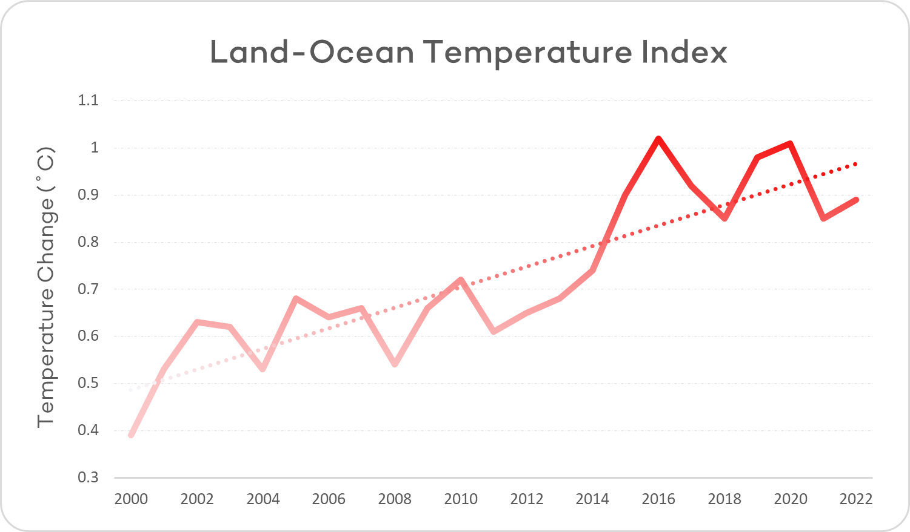

# What's with the heat? | Earth Day 2024

## by Oluwaseyi Aderemi

Today, April 22nd, is Earth day. 

I'm sure a good number of you are just hearing of this for the first time. If you're not one of them, good job. But if you are, no need for a quick trip to Google, I'll explain what it is all about shortly.
So, here's the gist of it: Earth day, first held on April 22, 1970, was set aside every year, not just to create awareness of the issues that bother our planet, but to also host events and discuss solutions to them during the week. On Earth Day 2020, over 100 million people around the world observed the 50th anniversary in what is being referred to as the largest online mass mobilization in history. Each Earth day has a theme, an issue to be focused on and the one for this year is: "Planet vs Plastics". However, due to personal reasons, I'd rather talk about something that's been on my mind for a while now, that is, the freaking heat!!!, or to put it more formally, Global Warming.

When you live in a country like I do, you'll have no problem noticing that the climate is actively changing. The days and – because of physics – nights are a lot hotter than I remember from when I was growing up. Also, I live in a house without air-conditioning and steady power supply, so we all have to bear the brunt of the heat, with open windows and pray that the mosquitoes mind their business. This goes for majority of the population by the way, not just me.

Out of pure frustration, I decided to use my new found data analytics skills to find out why this is happening. Even if I can't fix it myself, I'll do my part in raising awareness about this issue. After some research and reflection on what I've learnt from Basic science in school and from the internet, I found the right place to look, that is centered on the human need for energy. Any science student when asked to define energy will say that it is the ability to do work.  

Work, in its most basic definition means to move an object from one place to another. Human beings derive energy from the food we eat, which we digest and gain the ability to get things done. Early man, in the stone age depended on manual labour to get things done. However, the demands of an ever growing population with infinite needs required amounts of energy that exceeds the manual abilities of man, to lift heavy loads, travel long distances for trade and to farm large expanses of land for food to say the least. We created various mechanisms to give us an advantage, and help with the work load, using water-wheels, wind and beasts-of-burden as sources of power to do the work for us.

The Industrial revolution, spear-headed by the invention of the steam engine, gave us a way to take fuel which contained chemical energy and burn it to release heat, which through cleverly designed components, got converted into rotational energy which was mainly used to pump water. Further engineering produced the internal combustion engine, which burned oil or gas to give the same effect and was mainly used to power transport vehicles. Currently, global supply chains are run by vehicles powered by these engines and the world as we know it is solely dependent on them.

Fossil fuels like coal and oil, are sought after because they contained more energy than virtually every other fuel source available. But, this wonderful energy comes at a cost, in the form of the waste gases produced when they are burned, which are emitted into the atmosphere – the blanket of air surrounding our planet. Fossil fuels were formed from carbon deposits from ancient plant and animal remains buried underground. That ancient carbon is what is being released after burning into the air in addition to the already existing carbon cycle.

These waste gases – Carbon dioxide, Methane and Sulphur dioxide – went unnoticed until acid rain began to occur due to the gases dissolving in rain water forming acids which affected ecosystems. They were also later dubbed Green-house gases due to the Green-house effect, which basically means that the heat coming from the sun to the earth, which would have otherwise been reflected back into space, now spends more time within our atmosphere because of these gases, thus heating up the atmosphere and upsetting the delicate balance that is our weather and climate.  

Global warming has so many effects, from melting of the polar ice caps, at the north and south poles of the planet, to rising sea levels. Increased occurrences of natural disasters like floods and hurricanes and Intense heat waves. The planet has began to change in so many ways that it can no longer be ignored. Countless lives and properties have been lost with more on the line unless we do something in unity as a civilization before irreparable damage is done to our beloved planet.

I said earlier that I am a data analyst, and with the foundation I've laid, I came up with a simple strategy, which was to "**follow the energy**". I got access to data from the Our world in data community which monitors and collates data about the energy usage of every country in the world and maintains a huge open source dataset. I also got some data from NASA regarding the Land-Ocean temperature changes or anomalies observed over the years. I worked on these datasets and arrived at some charts which I would use to communicate my findings.

## Data Insights

### 1. How much energy do we use?

    

So, this is the amount of energy is took to sustain the earth back in 2022. Its hard to grasp the magnitude of this number until you understand its unit of measurement.  
To make it a bit more relatable, think about your prepaid electricity meter at home. each unit you buy for that meter is one Kilowatt-hour (Kilo - 10³). The unit of measurement used here is in Terawatt-hours (Tera - 10⁹) which is six orders of magnitude or a million times more than a Kilowatt-hour. Also, notice that the value is also in the hundreds of thousands, increasing the disparity to 9 orders of magnitude or a billion times more that the kilowatt-hour you are used to. This is a really large number.

### 2. Where does our energy come from?

    

As at 2022, you can see that, we still depend heavily of the use of fossil fuels, 82% of all energy used comes from them. This value is split evenly between oil, coal and natural gas, which power transportation, electricity generation and industrial processes. It is important to notice the presence of the other energy sources, which are carbon-neutral in nature, that is, they do not contribute to the emission of Green-house gases into the atmosphere.  

### 3. How much are we emitting?

    

The chart is pretty straightforward. It shows the increasing amounts of CO₂ – the major Green-house gas – that we've dumped into the atmosphere from year 2000 to 2022 in billions tonnes of CO₂. That's a lot of gas!

### 4. What has it done to the planet?

    

This line chart displays the annual recorded temperature change (anomaly) of the land and oceans.
One thing is obvious, there's an uptrend made visible by the line of best fit drawn through the data points. This shows that there's actually an increase in the rate of change of the temperature of planet, a sort of acceleration – a second derivative – if you will.

### 5. Who is responsible?

    

Not to pass blame, but we can clearly see which countries we should focus on if we really intend to change things. China is the heavy duty and manufacturing giant of the world, and it also holds the largest population – and labour force – in the world of over a billion people. That says a lot in this issue.

## What can we do about this?

Before we go on, I'd like to point out how no African country made it to the top ten countries. That says a lot, given that Africa is the second largest continent on the planet. But I digress, because we all live on planet Earth and so we all have a role to play in returning the planet to her original state.

1. **Reduce our dependence on fossil fuels**:
   Alternative power sources such as solar, wind, geothermal and biofuels are available and are actively being worked on. If we take the time to learn about them and incorporate them into our lives we should gradually become less reliant on fossil fuels. Electric vehicles are also available, and the companies behind them are working to make them more affordable and assessible to the public.

2. **Research into efficient carbon capture techniques**:
   Carbon capture is the process of taking CO₂ out of the atmosphere and putting it elsewhere. Plants and algae do this naturally, through photosynthesis, storing it in their trunks and roots. We should find ways to promote this process through reforestation and other novel ideas.

3. **Education**:
   One thing that is quite apparent is the amount of energy that is wasted. This is only natural because of the laws of thermodynamics. However, if we take the time to educate people to be more conscious of the amount of energy they use, then we can make a difference.

## Conclusion

There's still a lot to talk about, and that is what this week is meant for. Any suggestions and contributions you have are more than welcome in the right communities. We all live on this planet and so we have no choice but to care for it as we would with things we hold dear. Let's put our heads together and bring the heat down.

## References

- Wikipedia contributors. (2024, April 22). Earth Day. In _Wikipedia, The Free Encyclopedia_. Retrieved 09:05, April 22, 2024, from [https://en.wikipedia.org/w/index.php?title=Earth_Day&oldid=1220150232](https://en.wikipedia.org/w/index.php?title=Earth_Day&oldid=1220150232)  
  
- Hannah Ritchie, Pablo Rosado and Max Roser (2023) - “Energy” Published online at OurWorldInData.org. Retrieved from: <https://ourworldindata.org/energy> [Online Resource]

- Abigail Bowman and Sandra May (2023) - Global Land-Ocean Temperature Index Data Set published at <https://www.nasa.gov/stem-content/global-land-ocean-temperature-index-data-set/>
